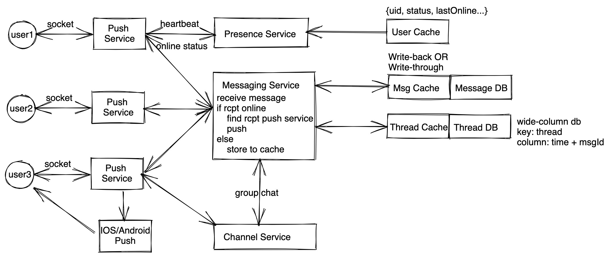

# 在线聊天系统 - Chat, Online Messaging Service

## 题目
设计在线聊天系统。又一个变体是实时评论系统（live comment）。在线聊天系统大多是双向的，一个用户和另一个用户会互相发信息，实时评论系统更多是单向的，一堆用户给一个帖子发评论，但是原理上类似。

## 需求
### 直接需求
* 用户之间可以互相聊天
* 用户可以查看其他用户状态，在线/离线/上次上线
* (进阶) 用户可以直到消息状态 ，已发送，发送成功，已读
* (进阶) 群聊

### 隐含需求
* 延迟要小，消息尽快送到
* 消息不能丢失
* （可能）服务器不能存消息记录


## 估算 （Estimation）
* DAU: 1B, 50 message per user per day
* Concurrent connections: 500M
* Read/Write QPS: 50 * 1B * 2 / 86400 ~ 50B/100k ~ 1M
* Data storage: Depends on if preserve chat history or not. If so, assumeing each message will have 8Bytes msgId, 4Bytes fromUsrId, 4Bytes toUsrID, 256B body  ~  300Bytes, total 50 * 1B * 365 * 5 year * 300Byte ~ 100TB

## 服务设计 (Service Design)


### 消息服务 message Service
消息服务管理用户发送的消息。用户和推送服务通过socket连接
#### 用户如何发送消息?
* 如果双方都在线，发消息直接给消息服务，消息服务找到接收人对应的推送服务，推送服务通过socket推送给接受人
* 如果收件人离线，消息存在thread和message缓存中，等收件人上线之后，推送服务去缓存中抓取新的消息，同时根据用户设备信息通知推送服务，推送服务可以通过iOS/Android等系统自带的推送服务推送一个提醒，提醒用户上线去抓取新的消息。
	


### 消息推送服务（push service）
当用户在线的时候，消息推送接有好几种模式：
1. 客户端每隔几秒钟pull一次服务器。缺点是实时性很差，浪费资源。
2. long-polling - 服务器不需要，服务器需要维持很多个session来维持等待响应的GET。
3. Socket: 好处是可以双向通信，保持TCP长连接，减少不断建立连接的overhead。

2和3都可以，我们选择选项3，不过考虑到每个机器最多只有65535端口，所以我们需要大量push service机器来维持连接。
```
                             ___ push service ______ push server socket(65k)
                            |___ push service    |__ push server socket(65k)
        MessageService -----|___ push service 
                            |___ push service 
```

当用户离线的时候，socket连接不存在，这时候有几个选项
1. 如果是移动端，使用操作系统的notifcation service，ios/android推送
2. 如果是网页端，等用户上线的时候主动pull信息

推送服务可以根据用户id来进行分配，分配方式类似一致性哈希，当需要给用户推送的时候，通过hash(userId)来找到用户所对应的机器，然后推送给用户即可。

#### 消息存储
如果直接去数据库找`select * message where from = xxx OR to = xxx order by createdAt`，效率非常低，所以我们应该另外建立一个thread表，结构如下。
```
Message(msgId, threadId, from, to, content, createdAt)
Thread(threadid, ownerid, participants(from,to), createdAt, isMuted)
```
我们系统读写都频繁，所以不建议使用SQL，选择NoSQL的时候，不建议选择简单的key-value store，因为每次读一个thread的信息，我们一般都需要读thread最新的消息，需要某个特定的顺序，所以选择wide-column NoSQL，比较合适，选择threadid作为key，然后一条新的消息就是一个column，column name可以是时间戳，这样column可以保证有序。

### 群聊服务 Group Chat
实现群聊有以下几个选项。
`给群里每个用户推送`：找到群里所有人，给所有人都推送消息，也就是fan-out-on-write。这样每次有人发送消息的时候，都需要去实时提取群信息，然后再进行分发。这样的缺点是如果群里面很多用户没有在线，大量消息需要缓存，

`建立一个channel让用户订阅`：增加一个订阅服务Channel Service，在线用户直接订阅服务里面的channal，当一个用户发言的时候，发言被推送到群对应的channel里面，订阅服务推送给订阅（在线）的用户。当用户上线的时候，去channel服务里订阅， 当用户下线的时候，从channel中删除该用户。

权衡利弊，这里我们选择channel模式。

### 在线状态服务（presence server）
在线服务也有几个不同的选择：
`每次上线通知好友`：每次用户上线，查找在线的好友，通知好友最新状态。这个方法看上去很简单，但是问题在于网络不好的地方用户可能频繁上下线，用户好友数很多，每次给好友push浪费大量资源。
`服务器通过heartbeat判断`：客户端每隔数秒给服务器发送一个heartbeat，然后服务器，假设一分钟没有收到heartbeat，更新用户状态为离线。用户每次上线去服务器提取用户列表和他们的状态即可。
这里选择使用heartbeat来判断，节省资源。用户在线状态可以直接存在内存内即可，除非有保存历史在线记录的需求，我们不需要把在线状态存到数据库里面持久化。


## 扩容
### 消息服务扩容
消息服务主要功能是接受用户发送消息，找到收件人然后分发给收件人，这个服务可以是stateless的，扩容起来比较容易，每次用户发送信息，根据一致性哈希选择服务器即可。

### 缓存
在内存中会有大量的thread，和message，所以我们需要选择分区。
`Messaging Sharding`： 一个选项是通过threadId来分区，这样一个thread的信息都在一个机器上，可以很方便直接提取一个thread里面所有对话。但是可能带来的问题是数据分布不均衡，另一个选项是通过messageid自身来分区，这样分布均匀，但是一个thread的消息需要去多个机器读取。考虑到我们系统需要尽量减少延时，我们可以选择选项一，通过一致性哈希的方式尽量减少分布不均问题。

`Thread Sharding`：很明显按照UserId来分区是最好的，这样一个用户的thread都在，而且用户之间会话一般不会导致hot partition。

`Channel Sharding`：每个channel只能按照channelid来分区，但是有的群会变得非常热门，所以我们可以考虑限制群聊人数上线，防止单点过热。

## 其他
#### 怎么维持消息顺序？
每个客户端时间可能不同，我们不能接受客户端的时间。
`服务器使用接受时间`：这样能一定程度保持有序，但是因为网络状况不同，可能先发的消息后到，这样下次读取信息的时候，服务器上的消息排列就乱序来。
`客户端维持一个递增的版本号`：每次发信带上版本号，收信的时候服务器发个更新的版本号，这样通过版本号比较，客户端可以正确地对排序。


#### 如果是实时评论系统怎么修改？
参考上面对群聊的处理，我们把群的channel换成帖子的channel，点开同一个帖子的人订阅到同一个channel，有更新的时候channel负责push更新到所有的订阅者上。
